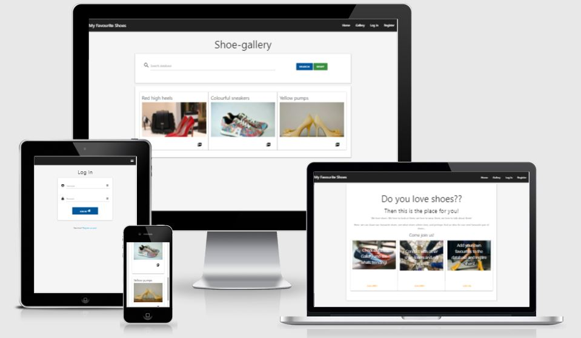
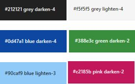

README-file- template

# "I Love Shoes"
## A web-site where shoe-lovers may share, discuss and talk about their favourite shoes 
Looking through the public gallery is open to anyone visiting the site, but in order to contribute to the database, you need to create a user and log in.

When entering a record for a pair of shoes, you may choose for it to be public (visible to everyone), og private (only visible on your private profile-page).

Click here to view the website http://i-love-shoes.herokuapp.com/home_page

## User Experience (UX)

### User stories:

### First time visitor goals
Exploring the site and getting inspired.

### Returning visitor goals
Register as a user, start to build my profile, or just get inspiration from others. Finding out if those beatiful deasigner-shoes I've dreamt about are actually comfortable to wear (or just pretty to look at), from someone who has already bought them.

### Frequent user goals
Sharing and getting followers. Perhaps promoting small shoe-brands?
May also be just for private use, keeping a record of all my shoes, to go through when I need to decide what to wear, or what I need to buy for the next season.

### Site owner goals
Get information on what shoelovers appreciate most in their shoes, and what variables should be available to choose from if the users were to design their own favourite shoes. Ultimately to create a "design-your-own-shoes"-shoe-brand.

## Design

### Colour scheme:
https://materializecss.com/color.html
- navbar: grey darken-4
- background: grey lighten-4
- submit/enter buttons: light-blue darken-4
- cancel/reset buttons: green darken-2
- flash: blue lighten-3
- delete buttons: pink darken-2

### Imagery:
- All images are from https://www.pexels.com/search/shoes/

## Wireframes

## Features

- Feature 1 included
- Feature 2 included
- Feature 3 included

#### Future features:
- Possible future feature 1 not yet included
- Possible future feature 1 not yet included

## Issues overcome

## Technology used
### Programming languages:
- html
- css
- JavaScript
- Python + Flask (flask pymongo)
- MongoDB
- jQuery

### Frameworks, libraries and programs:
- MaterializeCss https://materializecss.com
- RandomKeyGem (for secret_key) https://randomkeygen.com/
- Werkzeug Security Helpers (for user password-hashing)
https://werkzeug.palletsprojects.com/en/2.0.x/utils/#module-werkzeug.security

## Testing

### Validation:
## HTML validation
Lack of alt-attribute for images cane up as an error, and has been fixed.

JS validation

### Testing for user stories in UX-section:

### Further testing:
#### Test on different screen sizes:
Expected: X when Y
Testing: do Y
Result: The site did not respond due to ..."A" or: the site acted as expected and did X
Fix: Did Z to the code because of problem..."A"

#### Test on different browsers:
Expected: X when Y
Testing: do Y
Result: The site did not respond due to ..."A" or: the site acted as expected and did X
Fix: Did Z to the code because of problem..."A"

### Fixed bugs:
#### Bug 1

#### Bug 2

### Unfixed bugs:

## Deployment
This project was developed using Gitpod.io with the basic template from Code Institute. committed to git and pushed to GitHub using git-extensions in Visual Studio Code.

### Steps to deploy this page to GitHub Pages from GitHub repository:
1. Log into GitHub.
2. Find the project "" from the list of repositories and open it.
3. Go to the “Settings”-option.
4. Scroll down to the section called “Pages” in the menu on the left side, and click it to open the Github-pages page.
5. Under "Source", select the correct branch (in this case, “main”), and click on the Save-button.

6. The page will refresh, and the message on top says:
“Your site is ready to be published at: https://gurimarie.github.io/my_favourite_shoes/”
Use this link to access the deployed website.

### Forking the GitHub repository:

### Making a local clone:
1. Follow this link (MUST BE LINKED UP!) to the projects Github repository.
2. Under the repository name, click the green "Code"-button, and choose "https" and click on the "Download Zip"-option.
3. When the zip is downloaded, open the folder, and move the unzipped folder to where you wish to store it on your computer.
4. Open your Visual Studio Code (or other programming-software), click File, Open Folder, and choose the unzipped folder you just downloaded from where you saved it to.
 

TEST AND FILL OUT REST!!!

## Credits

### Code:

- https://github.com/PaulFrankling/discover-north-yorks used for README-structure.
- This project follows closely the Flask Mini-project from Module 3, Code Institute. The details are different but that project has been a template for the development of is project.

### Media used:
- All images are from https://www.pexels.com/search/shoes/ (free image-base)

